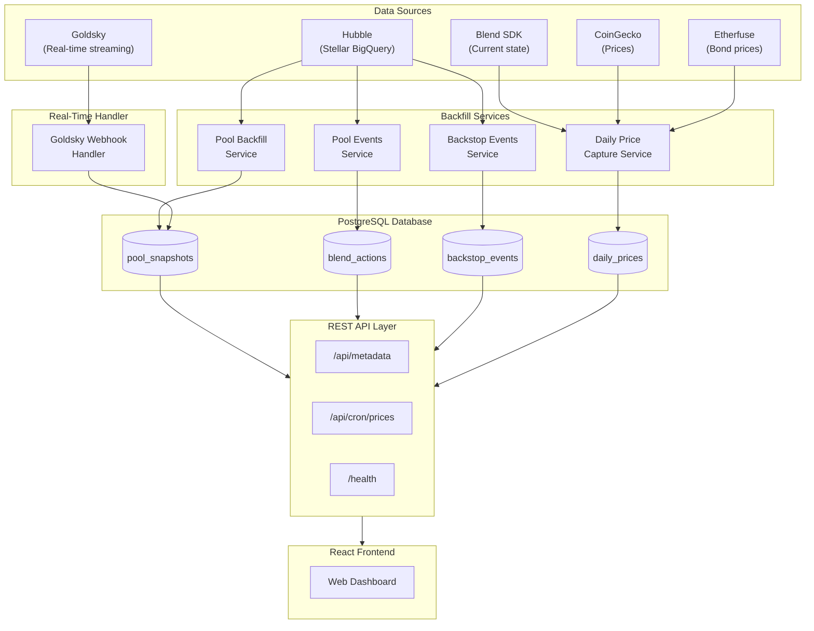
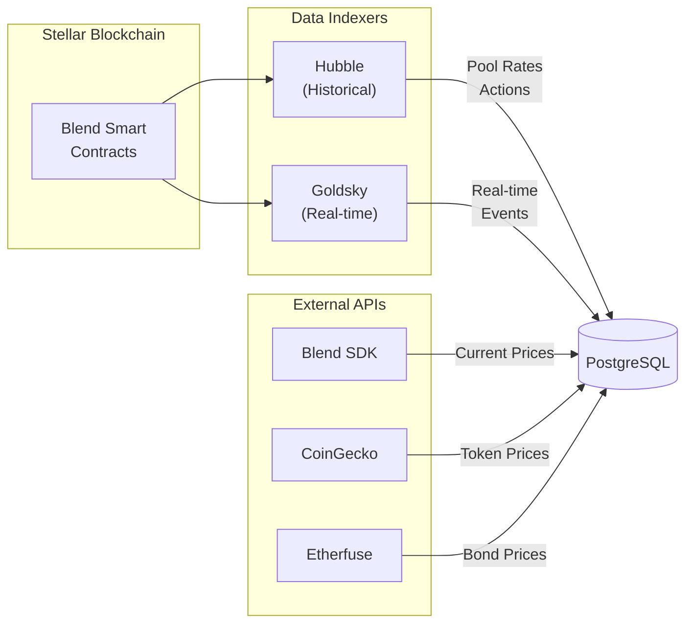
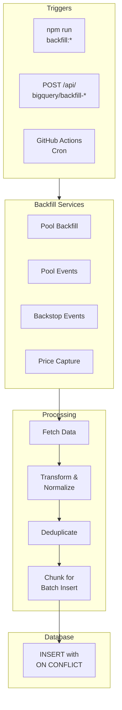
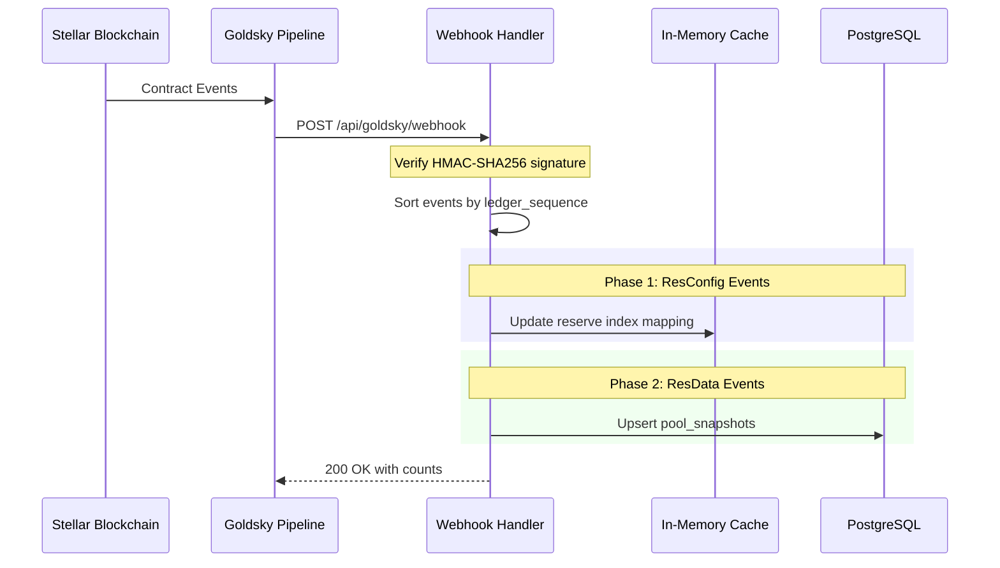
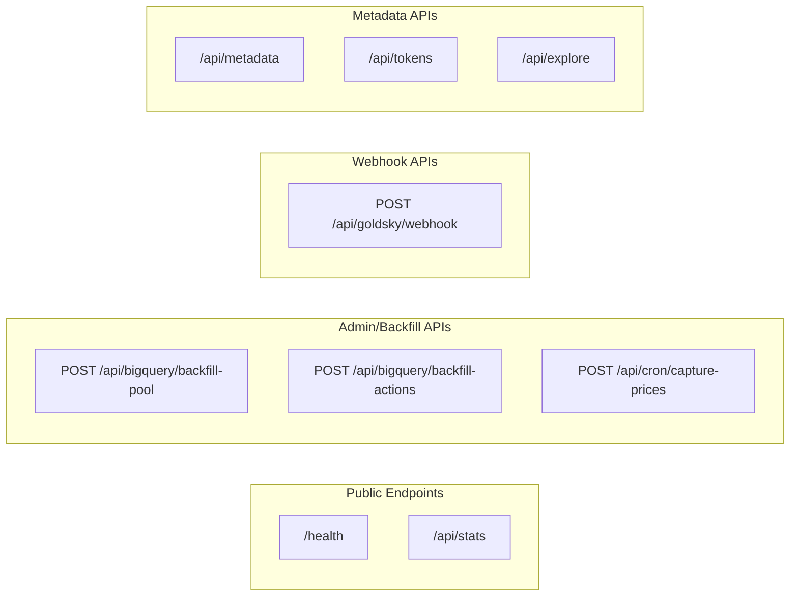
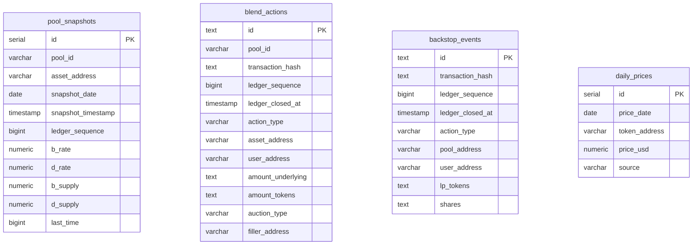

# Blend Protocol Backfill Backend

Backend service for ingesting and serving [Blend Protocol](https://blend.capital/) lending data on the Stellar network. This service aggregates historical and real-time data from multiple sources to provide comprehensive position tracking, balance history, and transaction data for the Blend lending protocol.

## Table of Contents

- [Overview](#overview)
- [Architecture](#architecture)
- [Data Sources](#data-sources)
- [Backfills & Data Pipelines Overview](#backfills--data-pipelines-overview)
- [Backfill Types](#backfill-types)
- [Real-Time Streaming](#real-time-streaming)
- [API Endpoints](#api-endpoints)
- [Database Schema](#database-schema)
- [Configuration](#configuration)
- [Scripts & Automation](#scripts--automation)
- [Tracked Pools](#tracked-pools)
- [Frontend](#frontend)
- [Documentation](#documentation)

---

## Overview

The Blend Protocol Backfill Backend is designed to:

1. **Ingest historical data** from Hubble (Stellar's public blockchain data on BigQuery)
2. **Stream real-time events** from Goldsky webhooks
3. **Store normalized data** in PostgreSQL for fast querying
4. **Serve data** via REST APIs for frontends and external services
5. **Track prices** from multiple sources (SDK, CoinGecko, Etherfuse)

### Tech Stack

- **Runtime**: Node.js 18+ with TypeScript
- **Web Framework**: Express.js
- **Database**: PostgreSQL (Neon serverless supported)
- **Data Sources**: Hubble (BigQuery), Goldsky
- **Blockchain SDK**: Blend Capital SDK + Stellar Soroban RPC

---

## Architecture

### High-Level System Architecture



### Project Structure

```
backfill_backend/
├── src/
│   ├── api/                       # Express server and routes
│   │   ├── server.ts              # Main Express application
│   │   └── routes/
│   │       ├── bigquery.ts        # BigQuery integration endpoints
│   │       ├── goldsky-webhook.ts # Real-time webhook handler
│   │       └── cron.ts            # Scheduled job endpoints
│   ├── services/                  # Business logic layer
│   │   ├── bigquery-client.ts     # BigQuery query client
│   │   ├── bigquery-pool-backfill.ts  # Pool rates backfill
│   │   ├── bigquery-actions-backfill.ts
│   │   ├── bigquery-backstop-backfill.ts
│   │   ├── goldsky-webhook-handler.ts
│   │   ├── daily-price-capture.ts # Price snapshot service
│   │   └── lp-price-backfill.ts
│   ├── repositories/              # Database access layer
│   │   ├── pool-repository.ts
│   │   ├── actions-repository.ts
│   │   └── backstop-repository.ts
│   ├── lib/blend/                 # Blend Protocol utilities
│   │   ├── discovery.ts           # Dynamic pool/asset discovery
│   │   ├── network.ts             # Stellar network configuration
│   │   └── pools.ts               # Tracked pools registry
│   ├── config/
│   │   ├── database.ts            # PostgreSQL connection
│   │   └── bigquery-config.ts     # BigQuery configuration
│   ├── scripts/                   # Runnable scripts
│   └── types/                     # TypeScript definitions
├── frontend/                      # React web UI
├── stellar-events-stream/         # Goldsky pipeline configs
├── .github/workflows/             # CI/CD automation
└── docs/                          # Additional documentation
```

---

## Data Sources

### Data Flow Overview



### 1. Hubble (Stellar's BigQuery Data)

**Dataset**: `crypto-stellar:crypto_stellar`

[Hubble](https://developers.stellar.org/docs/data/hubble) is the Stellar Development Foundation's public blockchain data, available on Google BigQuery. It provides access to historical Stellar blockchain data including smart contract state and events.

| Table | Purpose |
|-------|---------|
| `contract_data` | Pool rates |
| `history_contract_events` | Transaction events, actions |

**Query Modes**:
- **Individual**: One query per pool-asset (fine-grained control)
- **All Assets**: One query per pool (more efficient)
- **All Pools**: Single bulk query (optimal cost)

### 2. Goldsky (Real-Time)

Streams contract events as webhooks with HMAC-SHA256 verification.

**Event Types**:
- `ResConfig` - Reserve configuration changes
- `ResData` - Pool rate updates (b_rate, d_rate)

### 3. Price Sources

| Source | Data |
|--------|------|
| Blend SDK | LP token prices, BLND prices, Oracle prices |
| CoinGecko | Exchange rates for pegged tokens |
| Etherfuse | Bond token (TESOURO) prices |

---

## Backfills & Data Pipelines Overview

This section explains each backfill/data pipeline in the system, what data it captures, and what features it enables.

### 1. Blend Pool Events

**What it captures:**
- All user lending and borrowing actions across Blend pools
- Actions include: supply, withdraw, borrow, repay, claim, and liquidation auctions
- Tracks amounts, assets, and the rates at the time of each action

**What it enables:**
- Real-time tracking of user activity in lending pools
- Historical record of all protocol interactions
- Calculation of user earnings/costs between any two time periods
- Audit trail for all fund movements

### 2. Backstop Events

**What it captures:**
- All activity in the Backstop insurance fund
- Actions include: deposit, withdraw, queue/dequeue withdrawals, claims
- BLND emission distributions (gulp_emissions events)
- LP token share movements

**What it enables:**
- Tracking of backstop participant positions
- BLND rewards calculation for backstop depositors
- Monitoring of the protocol's insurance fund health
- Historical analysis of backstop participation

### 3. Pool Snapshots

**What it captures:**
- Daily state of each lending pool per asset
- Total token supply columns:
  - **b_supply**: total supplied tokens in the pool
  - **d_supply**: total borrowed tokens from the pool
- Interest rates for suppliers (b_rate) and borrowers (d_rate)

**What it enables:**
- TVL (Total Value Locked) history charts (b_supply × token price)
- Pool utilization tracking over time (d_supply / b_supply)
- Interest rate history and trends
- Emission APY calculations (BLND rewards divided by total supply)

### 4. LP Token Price Backfill

**What it captures:**
- Historical daily prices for the BLND-USDC LP token
- Derived from the backstop pool's total shares and USDC backing

**What it enables:**
- Accurate valuation of backstop positions in USD
- Portfolio value tracking for LP token holders
- Historical performance analysis of backstop investments

### 5. Token Prices Backfill

**What it captures:**
- Daily prices for all reserve assets (XLM, USDC, AQUA, etc.)
- BLND token price (derived from the 80/20 pool)
- Special asset prices (TESOURO Brazilian bonds from Etherfuse)
- Pegged currency rates (EUR, GBP stablecoins)

**What it enables:**
- USD valuation of all positions
- Portfolio total value calculations
- Historical performance and P&L analysis
- APY calculations in dollar terms

### 6. Emission APY Backfill (daily_emission_apy table)

BLND tokens are distributed as incentives to protocol participants. This backfill calculates the APY from those incentives.

**What it captures:**
- Daily BLND emission APY for three participant types:
  - **Backstop depositors**: BLND rewards for providing insurance to pools
  - **Lending suppliers**: BLND rewards for depositing assets into pools
  - **Lending borrowers**: BLND rewards for borrowing (incentivized borrowing)
- For each day, stores: emission rate (EPS), total supply, BLND price, asset price, and calculated APY

**How it's calculated:**
- Formula: `(emissions per year / total supply) × BLND price / asset price`
- The more people participate, the lower the APY (rewards split among more users)
- The higher BLND price, the higher the APY value in dollar terms

**What it enables:**
- Display of incentive APY alongside base interest APY (so users see total yield)
- Historical charts showing how BLND rewards have changed over time
- Comparison of earning opportunities across pools and assets
- Understanding the "real" yield (base rate + BLND incentives)

### 7. Daily Price Capture

**What it captures:**
- Automated daily snapshot of all token prices
- LP token price from Backstop SDK
- BLND price from pool ratio
- Reserve token prices from oracles
- External prices from CoinGecko and Etherfuse

**What it enables:**
- Up-to-date portfolio valuations
- Continuous price history without gaps
- Reliable source of truth for current prices

### 8. Pools & Tokens Sync

**What it captures:**
- Reference data for all tracked pools
- Token metadata (symbol, name, decimals) discovered from events
- Asset addresses used across the protocol

**What it enables:**
- Proper display of token names and symbols in the UI
- Correct decimal handling for all assets
- Discovery of new assets as they're added to pools

### How They Work Together

```
Blockchain Events
       │
       ├── Pool Events ──────────┬──► User Activity History
       │                         │
       └── Backstop Events ──────┘
                │
                │
       Pool Snapshots ───────────┐
                │                │
       Token Prices ─────────────┼──► Portfolio Valuation
                │                │
       LP Token Prices ──────────┘
                │
                │
       Emission APY ─────────────────► Total Yield Calculations
```

### Key Use Cases Enabled

| Use Case | Required Backfills |
|----------|-------------------|
| Show user's current positions | Pool Events, Token Prices |
| Calculate earnings over time | Pool Events, Pool Snapshots, Token Prices |
| Display total APY (base + emissions) | Pool Snapshots, Emission APY, Token Prices |
| Track backstop rewards | Backstop Events, LP Prices, BLND Price |
| Historical portfolio value | Pool Events, Token Prices (all dates) |
| Liquidation monitoring | Pool Events (auction events) |

---

## Backfill Types

### Backfill Process Flow



### 1. Pool Backfill

**Purpose**: Populate `pool_snapshots` with interest rates and supply totals

**Data Captured**:
- `b_rate` - Supply rate index (normalized decimal)
- `d_rate` - Debt rate index (normalized decimal)
- `b_supply`, `d_supply` - Total supplied/borrowed tokens
- `last_time` - Blockchain timestamp

Pool snapshots can be backfilled via BigQuery API endpoints or are populated in real-time by Goldsky.

### 2. Pool Events

**Purpose**: Capture user transaction history

**Action Types**:
| Action | Description |
|--------|-------------|
| `supply` | Deposit tokens to earn interest |
| `withdraw` | Remove supplied tokens |
| `supply_collateral` | Deposit as collateral |
| `withdraw_collateral` | Remove collateral |
| `borrow` | Take out a loan |
| `repay` | Pay back borrowed tokens |
| `claim` | Claim BLND emissions |
| `new_auction` | Liquidation auction created |
| `fill_auction` | Liquidation auction filled |

Pool events are streamed in real-time via Goldsky pipelines directly to the `blend_actions` table.

### 3. Backstop Events

**Purpose**: Track backstop pool (insurance) events

**Event Types**:
- Deposit/Withdraw LP tokens
- Queue withdrawals
- Claim rewards
- Gulp emissions (BLND distribution)

Backstop events are streamed in real-time via Goldsky pipelines directly to the `backstop_events` table.

### 4. Daily Price Capture

**Purpose**: Scheduled daily price snapshots

**Sources**:
- Blend SDK: LP token, BLND, Oracle prices
- CoinGecko: Token exchange rates
- Etherfuse: Bond token prices

Triggered by GitHub Actions cron (daily at midnight UTC).

---

## Real-Time Streaming

### Goldsky Webhook Flow



### Event Processing Phases

1. **Phase 1 - ResConfig**: Extract reserve index → asset address mapping, cache in memory
2. **Phase 2 - ResData (Pool/Rates)**: Extract b_rate, d_rate, create pool snapshots

### Security

- HMAC-SHA256 signature verification
- Timing-safe comparison to prevent timing attacks
- Events sorted by ledger sequence for consistency

---

## API Endpoints

### Endpoint Overview



### BigQuery Integration

| Endpoint | Description |
|----------|-------------|
| `POST /api/bigquery/backfill-pool` | Trigger pool snapshots backfill |
| `POST /api/bigquery/backfill-actions` | Trigger actions backfill |
| `GET /api/bigquery/status` | Backfill progress/status |
| `GET /api/bigquery/discover` | Discover pools and assets |

### Webhook & Streaming

| Endpoint | Description |
|----------|-------------|
| `POST /api/goldsky/webhook` | Receive Goldsky events |
| `GET /api/goldsky/status` | Webhook processing stats |

### Metadata & Prices

| Endpoint | Description |
|----------|-------------|
| `GET /api/metadata` | Pool/token metadata |
| `GET /api/tokens` | Token list with details |
| `GET /api/token-statistics` | Token prices & stats |
| `GET /api/emission-apy` | BLND emission APY data |
| `POST /api/cron/capture-prices` | Trigger price capture |

### Health

| Endpoint | Description |
|----------|-------------|
| `GET /health` | Server and database health |
| `GET /api/stats` | Overall data statistics |

---

## Database Schema

### Entity Relationship Diagram



### Table Details

#### pool_snapshots
Daily interest rates and supply totals per asset.

```sql
UNIQUE(pool_id, asset_address, snapshot_date)
INDEX: idx_pool_snapshots_lookup (pool_id, asset_address, snapshot_date)
```

#### blend_actions
Transaction history for all user actions.

```sql
PRIMARY KEY: id (derived from tx_hash + index)
INDEX: idx_actions_user (user_address, ledger_closed_at)
```

#### backstop_events
Backstop pool (insurance) event history.

```sql
PRIMARY KEY: id
INDEX: idx_backstop_user (user_address, ledger_closed_at)
```

---

## Configuration

### Environment Variables

Create a `.env` file from the template:

```bash
cp .env.example .env
```

| Variable | Description |
|----------|-------------|
| `DATABASE_URL` | PostgreSQL connection string |
| `GOOGLE_CLOUD_PROJECT` | GCP project ID for BigQuery |
| `GOOGLE_APPLICATION_CREDENTIALS` | Path to GCP service account key |
| `GOLDSKY_WEBHOOK_SECRET` | HMAC secret for webhook verification |
| `STELLAR_NETWORK` | `mainnet` or `testnet` |
| `STELLAR_RPC_URL` | Soroban RPC endpoint |
| `NODE_ENV` | `development` or `production` |
| `PORT` | Server port (default: 3000) |

### BigQuery Setup

See [BIGQUERY_SETUP.md](BIGQUERY_SETUP.md) for detailed configuration.

### Goldsky Setup

See [GOLDSKY_SETUP.md](GOLDSKY_SETUP.md) for webhook configuration.

---

## Scripts & Automation

### Available Scripts

```bash
# Development
npm run dev              # Start backend + frontend (concurrent)
npm run dev:backend      # Backend only (port 3008)
npm run dev:frontend     # Frontend only (port 5173)

# Production
npm run build            # Compile TypeScript + build frontend
npm start                # Run production server

# Database
npm run setup            # Create tables and indexes

# Backfills
npm run backfill:lp-prices    # LP token prices

# Note: Pool events and backstop events are handled by Goldsky pipelines

# Utilities
npm run sync:pools-tokens     # Sync pool/token reference data
```

### GitHub Actions Workflows

| Workflow | Schedule | Purpose |
|----------|----------|---------|
| `daily-prices.yml` | Daily at 00:00 UTC | Capture token prices |

---

## Tracked Pools

The service tracks the following Blend Protocol pools:

| Pool Name | Contract ID | Version |
|-----------|-------------|---------|
| YieldBlox | `CCCCIQSDILITHMM7PBSLVDT5MISSY7R26MNZXCX4H7J5JQ5FPIYOGYFS` | V2 |
| Blend Pool | `CAJJZSGMMM3PD7N33TAPHGBUGTB43OC73HVIK2L2G6BNGGGYOSSYBXBD` | V2 |
| Orbit | `CAE7QVOMBLZ53CDRGK3UNRRHG5EZ5NQA7HHTFASEMYBWHG6MDFZTYHXC` | V2 |
| Forex | `CBYOBT7ZCCLQCBUYYIABZLSEGDPEUWXCUXQTZYOG3YBDR7U357D5ZIRF` | V2 |
| Etherfuse | `CDMAVJPFXPADND3YRL4BSM3AKZWCTFMX27GLLXCML3PD62HEQS5FPVAI` | V2 |

**Configuration**: [src/lib/blend/pools.ts](src/lib/blend/pools.ts)

Assets for each pool are discovered dynamically via the Blend SDK.

---

## Frontend

A React frontend is included for visualizing data:

```bash
# Development (runs on port 5173)
npm run dev:frontend

# Or run both backend and frontend
npm run dev
```

The frontend is served from the backend Express server in production.

---

## Documentation

- [BIGQUERY_SETUP.md](BIGQUERY_SETUP.md) - BigQuery configuration guide
- [GOLDSKY_SETUP.md](GOLDSKY_SETUP.md) - Real-time streaming setup
- [docs/BLEND_EVENTS.md](docs/BLEND_EVENTS.md) - Blend Protocol event types

---

## Prerequisites

- Node.js 18+
- PostgreSQL database (or [Neon](https://neon.tech/) serverless Postgres)
- One or more data sources:
  - Google Cloud account with BigQuery access (for Hubble data)
  - Goldsky account for real-time streaming

---

## Quick Start

1. **Install dependencies**:
   ```bash
   npm install
   ```

2. **Configure environment**:
   ```bash
   cp .env.example .env
   # Edit .env with your credentials
   ```

3. **Create database tables**:
   ```bash
   npm run setup
   ```

4. **Start the server**:
   ```bash
   npm run dev
   ```

Server runs on `http://localhost:3000`

---

## Contributing

Contributions are welcome! Please open an issue or submit a pull request.

---

## License

MIT
